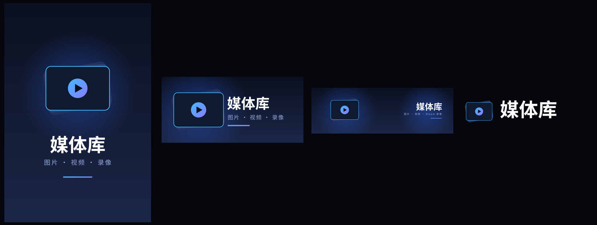

# media-deck

Steam Deck 原生「图片 + 视频 + Steam 录像」浏览器，专为**游戏模式**设计。
一个窗口内完成浏览与播放：**不调用浏览器、不启动外部播放器进程、不改动系统**。



## 为什么需要它

- Steam Deck 游戏模式的库**只列游戏**：软件、工具、截图、录像都没有入口；
  库筛选器里也**没有**「软件 / 工具」这类选项（桌面模式的 Steam 才有）。
- 把文件管理器加成非 Steam 游戏后，它用 `xdg-open` 把播放器交给**看不见的桌面会话**：
  进程真的起来了，但窗口在别处 —— 用户视角就是"点了没反应"，于是狂点 →
  起一堆重型播放器 → 内存爆 → 卡死甚至崩溃，只能重启或终端杀进程。

media-deck 把「扫描 → 缩略图 → 播放」全部收进**同一个窗口**，所有操作都看得见。

## 功能

- 自动扫描（跟随 `~/Pictures` 里的软链接，也直接扫真实目录；按真实路径去重）：
  - `~/Pictures`、`~/Videos`
  - Steam 截图 `userdata/*/760/remote/**/screenshots`（会跳过 `thumbnails` 重复图）
  - Steam 录像 `userdata/*/gamerecordings/clips`
  - 壁纸引擎 `steamapps/workshop/content/431960`
  - 游戏内截图 `steamapps/compatdata/*/pfx/**/Pictures` 与 `~/Games/*/pfx/**/Pictures`
- 统一画廊：**一行 4 个 16:9 卡片**，下方显示**文件名 + 位置**
- **文件夹视图**：点「文件夹」把内容按目录收纳成**带预览的文件夹卡片**（含项数）
- 图片与视频**同一套**缩放/拖动：双指捏合缩放（0.2x–8x），**放大后**单指拖动平移
- **Steam 录像**（DASH `.m4s` 分片）首次播放时自动用 ffmpeg 转封装成 mp4 并缓存
- 视频**自动循环播放**，底部带**播放/暂停 + 进度条 + 时间**（触摸/鼠标可拖动跳转）
- **动画图片（GIF / WebP）自动播放并循环**
- 手柄开箱即用（内置 `evdev` 直读 Steam Deck 控制器）
- 真实触摸：集成 `steamdeck-touchfix`，保持 `STEAM_TOUCH_CLICK_MODE=4`

## 依赖

- Python 3 + PyGObject（SteamOS 自带）
- ffmpeg（SteamOS 自带）
- Python `evdev`、`GdkPixbuf`（SteamOS 自带）
- SteamOS 的 GStreamer **缺 H.264/AAC 解码器** → 本仓库**随 app 附带**
  （`fetch-codec.sh` 从 SteamOS 官方仓库取 `gst-libav`，只放进 app 自己的 `gst/`，**不改系统**）

## 一键安装（桌面模式）

```bash
git clone https://github.com/ranlinyi/media-deck.git
cd media-deck
./install.sh
```

脚本会：

1. 把程序装到 `~/.local/share/media-deck`
2. 取回缺失的解码器到 `~/.local/share/media-deck/gst`
3. 创建桌面项 `~/.local/share/applications/media-deck.desktop`
4. 若已存在「媒体库」非 Steam 快捷方式，**自动装好四卡槽配图**

若还没有快捷方式，脚本会提示你在 Steam 里「**添加非 Steam 游戏**」勾选「媒体库」，
然后**再跑一次** `./install.sh` 即可。

## 手动安装

```bash
cp -r media-deck ~/.local/share/media-deck
chmod +x ~/.local/share/media-deck/launch.sh ~/.local/share/media-deck/fetch-codec.sh ~/.local/share/media-deck/steamdeck-touchfix
~/.local/share/media-deck/fetch-codec.sh
# Steam -> 游戏 -> 添加非 Steam 游戏 -> 目标选 ~/.local/share/media-deck/launch.sh
```

## 操作

| 场景 | 操作 |
|---|---|
| 网格 | 左摇杆 / 十字键移动选择；**A** 打开；**L1 / R1** 切换分类（全部→图片→视频→录像） |
| 查看器 | **A** 播放/暂停；**B** 返回；**← / →** 上一个/下一个（视频中为快退/快进）；**L1 / R1**（含 L2/R2）视频快退/快进 5 秒 |
| 图片/视频 | **双指捏合**缩放；**放大后单指拖动**平移；左右滑动**不切换**（避免误触） |
| 桌面模式 | 鼠标点击、滚轮滚动、`+` / `-` 缩放、Esc 返回、空格播放/暂停 |

## 工作原理

- `app.py` —— GTK4 界面。用一个自定义 `Gdk.Paintable` 在**快照（snapshot）阶段**做缩放/平移，
  控件尺寸**始终不变**，所以缩放只触发重绘、不引发布局抖动，连续顺滑。
- 播放控制条用 `Gtk.MediaControls`（查看器里没有 `Gtk.Video`，因此只有这一条，不会重复）；
  动画图片用 `GdkPixbuf.PixbufAnimation`，由同一个 33ms 定时器逐帧推进。
- `media.py` —— 扫描（去重/跟随软链接/跳过 thumbnails）、缩略图（图片走 GdkPixbuf，视频走 ffmpeg）、
  Steam 录像 DASH 分片转封装。
- `steamdeck-touchfix` —— 来自 [steamdeck-gamemode-multitouch-fix](https://github.com/ranlinyi/steamdeck-gamemode-multitouch-fix)：
  Steam 会给非 Steam 快捷方式在 Xwayland 根窗口写 `STEAM_TOUCH_CLICK_MODE=1`，
  gamescope 便把触摸降级成单点鼠标；该脚本持续把它改回 `4`（真触摸透传）。
- `fetch-codec.sh` —— 从 SteamOS 官方仓库下载 `gst-libav`，解出 `libgstlibav.so` 放进 `gst/`，
  启动时用 `GST_PLUGIN_PATH` 指过去。

## 命令行

```bash
~/.local/share/media-deck/launch.sh --open ~/Pictures/a.gif   # 启动即打开指定文件
MEDIA_DECK_OPEN=~/Videos/b.mp4 ~/.local/share/media-deck/launch.sh
```

## 故障排除

- **库里看不到某些内容**：试试顶部**分类**和「**文件夹**」按钮；录像首次播放需要先转封装（几秒）。
- **视频缩放发顿 / 风扇转**：视频目前是**软件解码**（SteamOS 没有 GStreamer 硬解插件）。
  可以再把 `gstreamer-vaapi` 也随 app 带上走 GPU 硬解。
- **Steam 里自定义封面没显示**：重启一次 Steam。
- **解码器重新下载**：`~/.local/share/media-deck/fetch-codec.sh`（SteamOS 大版本更新后可能需要重跑）。
- **停止后台服务**：应用是单实例，直接关窗口即退出。

## 目录结构

```
media-deck/
  app.py                 GTK4 界面（画廊 / 文件夹视图 / 查看器 / 手柄 / 触控）
  media.py               扫描、缩略图、DASH 录像转封装
  launch.sh              启动器（套 touchfix + 日志）
  steamdeck-touchfix     触控透传修复（vendored）
  fetch-codec.sh         取缺失解码器到 ./gst
  install.sh             一键安装
  artwork/               Steam 四卡槽配图（png + svg 源）
  README.md  LICENSE  CHANGELOG.md
```

## 许可

MIT（见 LICENSE）。`steamdeck-touchfix` 来自作者自己的
[steamdeck-gamemode-multitouch-fix](https://github.com/ranlinyi/steamdeck-gamemode-multitouch-fix)。
